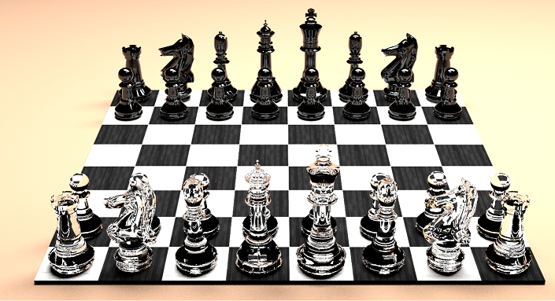

# Vixen
## C++ chess engine

 

**Implemented features so far**

_1.  Pseudo-Legal Move Generation_\
_2.  Magic Bitboards_\
_3.  Perft Testing_\
_4.  FEN Parsing_\
_5.  User Interface_\
_6.  UCI interface_\
_7.  Alpha-Beta Search_\
_8.  Principal Variation Table_\
_9.  Iterative Deepening_\
_10. PV Move Ordering_\
_11. MVV\LVA: Most Valuable Victim\Least valueable aggressor_\
_12. Killer Heuritics_\
_13. History Heuristics_\
_14. In-Check extension_

**Future implementation**

1.   Time management

**Prerequisites**

_1.  Download CMake at least 3.13 [from here](https://cmake.org/download/)_\
_2.  Download MinGW 9.2.0 [from here](https://www.msys2.org/)_\
_3.  Run install.bat (for windows) or install.sh for linux_\
4.  Executables can be found in bin folder
